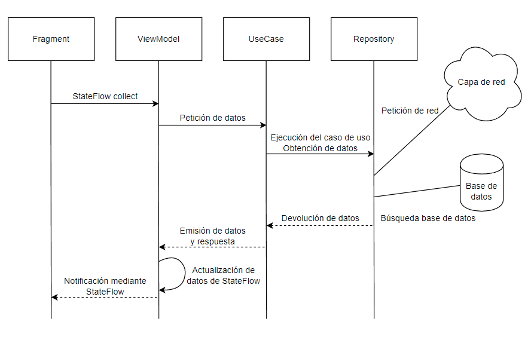

# MarvelApiApp
**Implementación de ejemplo de uso de la Api de Marvel**  
Aplicación desarrollada como ejemplo de prueba para hacer uso de la Api de Marvel, a continuación, en las diferentes secciones podrá comprobar los detalles técnicos de la misma.

- [Arquitectura](#arquitectura)
- [Librerías](#librerías)
- [Características](#características)
- [Api Marvel](#api-marvel)
- [Configuración](#configuración)

## Arquitectura
La aplicación se ha realizado utilizando la arquitectura **MVVM** y siguiendo normas de clean architecture, además se implementa en modo aplicación de *single-activity*.  También se han tenido en cuenta los diferentes principios **SOLID** para que el código sea mantenible y testable facilmente.

Se ha dividido el proyecto en tres modulos:
- **App** : Es el módulo principal de la aplicación. Aquí se realiza la inyección de dependencias mediante Hilt y contiene las diferentes pantallas (MainActivity, Fragments y ViewModels) que la conforman. Adicionalmente, se añaden extensiones de vistas y BindingAdapters para facilitar y simplificar el desarrollo.
- **Domain** : Este módulo contiene la definición de casos de uso y sus diferentes implementaciones. Además, se definen los modelos de datos utilizados en la aplicación y los esqueletos de los repositorios de datos.
- **Data** : El último módulo corresponde al de datos y aquí se encuentran las implementaciones de los repositorios junto a las capas encargados de recuperarlos. Se implementan dos fuentes de datos:
  - *Network* mediante el uso de Retrofit
  - *Database*: mediante el uso de Room

El flujo de datos es el siguiente:

## Librerías
- [Hilt](https://dagger.dev/hilt/), como inyector de dependencias.
- [Retrofit](https://square.github.io/retrofit/), para realizar las diferentes peticiones de red.
- [OkHttp](https://square.github.io/okhttp/), aporta el cliente Http.
- [Picasso](https://square.github.io/picasso/), es el encargado de recuperar y mostrar las imágenes.
- [ViewModel](https://developer.android.com/topic/libraries/architecture/viewmodel), para gestionar los datos de las pantallas.
- [StateFlow](https://developer.android.com/kotlin/flow/stateflow-and-sharedflow), como manera de actualizar las vistas de forma automática y gestor de eventos.
- [Room](https://developer.android.com/topic/libraries/architecture/room), aporta el sistema de guardado local de datos.
- [Navigation](https://developer.android.com/guide/navigation), para facilitar la implementación de la navegación en la aplicación.
- [Mockk](https://mockk.io/), aporta las herramientas para desarrollar y ejecutar las pruebas.
- [Secrets Gradle Plugin](https://github.com/google/secrets-gradle-plugin), definición de las claves del api.
- [SwipeRefreshLayout](https://developer.android.com/jetpack/androidx/releases/swiperefreshlayout), recarga a petición de RecyclerViews de la aplicación.

## Características
- Gestión de imágenes mediante Picasso, que se encarga de descargar, cachear y ajustar los datos para mejorar el rendimiento.
- Sistema de mapeo de entidades que permite la conversión bidireccional de datos (from -> to; to -> from).
- Implementación de inyección de dependencias para la creación de instancias unicas en la aplicación de repositorios, capa de red, base de datos, mappers, etc...
- La aplicación cuenta con un sistema de desplazamiento infinito que se implementa mediante los listeners de RecyclerView. Además, SwipeRefreshLayour permite recargar los datos del listado en cualquier momento.
- Se añaden tests para los repositorios, extensiones, viewmodels y más.
- Las claves de la api se guardan en *local.properties* y son gestionados por un plugin del graddle que se encarga de añadirlos al BuildConfig.
- Uso de los campos limit y offset para la recuperación de un rango de datos tanto en la capa de red como en la de base de datos.
- La navegación entre pantallas (Fragments) de la aplicación se realiza mediante Navigation y en el grafo, ubicado en res/navigation/nav_graph, se definen las pantallas, los parámetros que aceptan y sus posibles destinos. También, se habilita el plugin de Safe Args para poder asegurar que los *Fragments* reciben los datos esperados y poder utilizarlos sin comprobaciones adicionales.
- Manejo de errores para evitar el crash de la aplicación si se produce algún fallo y notificar al usuario que algo ha salido mal.

## Api Marvel
Como fuente de datos para el proyecto, se utiliza la Api de Marvel. La documentación de esta se puede localizar [aquí](https://developer.marvel.com/docs) y se requiere el registro para poder obtener la clave pública y privada necesarias para el proyecto. El registro se realiza esta [página](https://developer.marvel.com/account).

Para el desarrollo de la aplicación, se hace uso de los siguientes métodos:
- [GET] [/v1/public/characters](https://developer.marvel.com/docs#!/public/getCreatorCollection_get_0)
- [GET] [/v1/public/characters/{characterId}](https://developer.marvel.com/docs#!/public/getCreatorCollection_get_1)

## Configuración
Tiene que crear un archivo *local.properties* en el directorio raíz del proyecto con los siguientes datos:
| Key | Valor | Aplicación |
| --- | ----- | ---------- |
| PUBLIC_KEY | Clave pública | BuildConfig.PUBLIC_KEY |
| PRIVATE_KEY | Clave privada | BuildConfig.PRIVATE_KEY |
| API_URL | https://gateway.marvel.com/v1/public/ | BuildConfig.API_URL |
